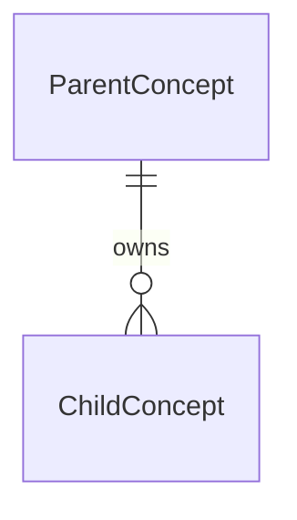

# Specify Domain

Create, reconstruct, or revise the specification foundation for one bounded product domain. Before this workflow is adopted, existing code, tests, plans, and documentation are evidence for human review. After `docs/spec/catalog.md` exists, `docs/spec/` is authoritative for intended behavior, while code and tests remain evidence of observed implementation.

Standalone use-case semantics are owned by `/spec-uc`. When a foundation change affects accepted use cases, `/spec-domain` owns discovery, combined review, approval, and atomic application of the complete coordinated set in one workflow.

## Input

The user provides a domain name and may provide a brief, scope, or evidence paths. Normalize the directory name to lowercase kebab case without changing the human-readable title.

## User Decisions, Stage Gates, and Skill Continuation

Call `AskUserQuestion` whenever a user decision is needed before recording a semantic change as settled. Give only the needed context and concrete mutually exclusive options, with the recommended option first; do not ask the user to decide repository facts or leave actionable choices only in a summary or handoff. **For every semantic foundation change that needs a decision, call `AskUserQuestion` and wait for the answer before using Write/Edit on any specification file.** Resolve semantic decisions before requesting final approval through `AskUserQuestion`, and continue independent discovery while answers are pending when possible. Never write a semantic change before the required decisions and approval.

An actionable stage gate is a point where the user must authorize a persisted state transition, choose whether work advances, or transfer control to another specification skill. Use `AskUserQuestion` at every actionable stage gate; narrative text alone never authorizes advancement. A semantic-answer question may authorize the corresponding confirmed working-artifact update without a redundant confirmation. After an approval, deterministic writing, validation, recovery, and status calculation continue without another prompt.

For a cross-skill handoff, ask whether to continue and name the target skill, artifact, reason, and recommended action. If the user selects continuation, immediately invoke the target through the host's skill mechanism with the resolved path and intent. Never invoke another skill merely because it appears relevant. If invocation is unavailable or permission is denied, preserve the current state, report the limitation, and provide the exact manual command as a fallback.

## Invariants

- Store specifications only under `docs/spec/`.
- Each domain owns one `catalog.md`, one `entity-model.md`, and flat numbered use cases created by `/spec-uc`.
- The root catalog contains product context, specification authority, the shared path convention, and one linked heading with a one-sentence description per domain.
- Domain catalogs contain no use-case status, owner, date, or progress fields.
- Existing non-specification documents remain where they are unless the user separately requests a move.
- This skill changes specification documents only, never application code or tests.

## Specification Authority

When `docs/spec/catalog.md` exists, root and domain catalogs and Entity Models are the reviewed foundation; `Approved` and `Implemented` use cases are accepted implementation contracts; and `Draft` and `Review` use cases are authoritative proposals, not implementation targets. Code and tests remain evidence of observed implementation, and differences from accepted specifications are implementation drift.

Stop on specification contradictions. Resolve product, domain, requirement, Entity Model, cross-use-case invariant, and terminology conflicts in this workflow. For a conflict limited to one interaction's behavior or status, use `AskUserQuestion` to offer direct continuation with `/spec-uc`; if selected, invoke it with the affected path and conflict.

## Stage 1 — Discover and Propose

1. Read the repository's `AGENTS.md`, `CLAUDE.md`, or equivalent instructions.
2. Read `docs/spec/catalog.md` when present and inspect neighboring domain catalogs and Entity Models.
3. Inspect relevant product documents, source, tests, and historical plans, using Specification Authority to distinguish intended behavior from implementation evidence.
4. Separate stated intent, observed behavior, implementation drift, contradictions, gaps, and assumptions. Surface conflicts inside the specification set instead of resolving them from code.
5. Bound the domain around one coherent product capability. Propose smaller domains when the vocabulary or responsibility is not comfortably reviewable as one unit.
6. Identify coherent requirement contracts, each with its capabilities and only the guarantees, constraints, and candidate use cases that it owns. Identify Entity Model external concepts, owned concepts and properties, relationships and cardinalities, shared value types, and concept-local invariants. Represent closed enumeration values in their owning property rows; do not create global policy, constraint, or enumeration sections.
7. Assign every normative statement to exactly one owning location before proposing artifacts: a property constraint, a concept-local invariant, a catalog requirement, or one use case. Do not persist this ownership analysis.
8. Screen each candidate as one externally meaningful primary-actor goal spanning an observable trigger through a meaningful outcome. Keep variants and failures serving the same goal together; do not create separate candidates merely for endpoints, buttons, CRUD operations, internal components, validations, or individual steps. Split independently valuable goals, triggers, or outcomes.
9. Inspect existing use cases of every status for effects from a proposed domain-boundary or Entity Model change. Classify each as an accepted member of a Coordinated Domain Change, an unchanged nonconflicting proposal, or a conflicting `Draft` or `Review` blocker.

Before any semantic write, prepare only this concise review summary and ask all required questions before editing:

```markdown
# Domain Review: [Domain]

## Proposed Semantic Changes

- **Product or domain definition:** [Behaviorally material change, if any.]
- **Boundary and scope:** [Owns, excludes, and responsibility changes.]
- **Requirements:** [Requirement contracts and their capability, guarantee, constraint, or owning-use-case changes.]
- **Entity Model:** [External concepts, relationship diagram, owned concepts and properties, concept-local invariants, and shared value types that would change.]
- **Candidate use cases:** [Names and one observable outcome each.]

## Affected Use Cases and Proposed Deltas

| Path | Current Status | Proposed Behavioral Delta | Resulting Status | Write Set |
|---|---|---|---|---|
| [Path] | [Status] | [Concise delta or blocker] | [Status or blocked] | [Included, unchanged, or blocked] |

## Decisions Needed

## Contradictions and Assumptions

## Evidence Consulted

## Affected Specification Paths
```

The summary must expose every behaviorally material choice without reproducing complete generated artifacts. Do not print or persist generated specification artifacts before approval, choose business intent, or interpret silence as approval. Keep existing accepted files unchanged during review. For an ordinary foundation change, resolve every decision and call `AskUserQuestion` once to offer approval and immediate writing or continued review.

## Coordinated Domain Changes

When a proposed domain or Entity Model change affects existing `Approved` or `Implemented` use cases, `/spec-domain` is the sole application coordinator and owns combined review and application in the current workflow:

1. Keep every persisted specification unchanged while discovering the complete foundation and use-case set. Read each affected accepted artifact and prepare its semantic delta with the foundation delta. The affected accepted path list must equal the eventual coordinated use-case write set.
2. Preserve each use-case path and sequence. Apply the canonical use-case structure and Behavior Diagrams rules from `/spec-uc`, including its `Approved Removal` exception. A revised `Approved` member remains `Approved`; a revised `Implemented` member becomes `Approved` until `/spec-impl` re-establishes conformance. Every finalized member has no `## Open Questions`.
3. Discover affected `Draft` and `Review` artifacts but do not automatically include or promote them. Leave a nonconflicting proposal unchanged. A proposal that would conflict with the revised foundation blocks approval and application; it may not be included, waived, or left stale. Use `AskUserQuestion` to offer direct continuation with `/spec-uc` to resolve that artifact or to stop. After it is resolved and `/spec-uc` offers continuation back, rediscover the complete coordinated set before seeking approval.
4. Resolve every semantic choice with `AskUserQuestion`, batching independent choices when useful. Do not seek separate approval for individual members.
5. When the complete set is conflict-free and no decision remains, re-read every target and present one concise whole-set summary. Call one final `AskUserQuestion` offering **Approve and apply complete set** or continued review. Selecting approval authorizes the foundation and every listed use-case delta as one unit.
6. After whole-set approval, immediately capture the exact pre-application content or nonexistence of every coordinator-owned target, including the root catalog, domain catalog, Entity Model, and each included use case. Verify that every target and the affected membership still match the reviewed baseline before the first write.
7. Behavior-neutral drift may be rebased only by updating the summary and recapturing pre-images. Semantic drift, changed membership, a newly discovered decision, or a newly discovered conflicting proposal invalidates the whole-set approval. Write nothing—or restore captured pre-images if application started—then resolve the issue through `AskUserQuestion`, rebuild the summary, and obtain whole-set approval again.
8. Otherwise use Write/Edit to apply the complete approved foundation and use-case set in one uninterrupted application phase. Cross-validate the complete set before reporting success.
9. If a write or validation fails, finish the exact approved set when doing so needs no new semantics; otherwise restore every coordinator-owned target to its captured content or nonexistence and validate the restoration. Never report partial application as success. If restoration fails, report the workflow as blocked and inconsistent.

## Stage 2 — Write After Explicit Approval

After approval through the applicable `AskUserQuestion` gate:

1. Re-read every target file so the merge uses current content. If this exposes a new semantic decision, invalidate approval, ask the user, refresh the review, and request approval again before writing.
2. Use Write/Edit only after every required `AskUserQuestion` answer and explicit approval; generate complete specification artifacts directly under `docs/spec`, not in the response.
3. For a Coordinated Domain Change, follow the atomic review, write-set, and recovery contract above in the same workflow; never defer accepted members to separate review commands.
4. If `docs/spec/catalog.md` is absent, create the canonical root structure below.
5. If the root catalog exists, preserve its product definition, Specification Authority section, and Structure section unless the user explicitly approved a shared change. Add or update only the affected linked domain heading and description and preserve unrelated entries.
6. Create or merge `docs/spec/<domain>/catalog.md` and `entity-model.md`.
7. For a new domain, omit the `Use cases` field from a requirement until at least one linked use-case file exists. Do not add links to files that do not exist.
8. For an existing domain, preserve unrelated requirement contracts, use-case links, and detailed use-case files.
9. If the accepted domain or Entity Model change would contradict an existing `Approved` or `Implemented` use case, treat it as a Coordinated Domain Change; do not write the foundation independently.
10. For an affected standalone use case outside a coordinated foundation change, use `AskUserQuestion` to offer direct continuation with `/spec-uc` instead of leaving an actionable narrative follow-up.
11. Apply focused deltas rather than regenerating reviewed documents.
12. Do not persist evidence lists, traceability IDs, lifecycle history, or generated metadata in the specification set.

## Canonical Postapproval File Structures

Use these structures to generate files with Write/Edit after approval. They are not response templates.

### `docs/spec/catalog.md`

````markdown
# Product Specifications

[One short product definition.]

## Specification Authority

The presence of this catalog means the project has adopted the specification workflow. Within `docs/spec/`:

- Root and domain catalogs and Entity Models are the reviewed specification foundation.
- `Approved` and `Implemented` use cases are accepted implementation contracts.
- `Draft` and `Review` use cases are authoritative records of proposals, but they are not implementation targets.
- Code and tests describe observed implementation. When they differ from an accepted specification, treat the difference as implementation drift rather than silently rewriting the specification.
- When specification artifacts contradict each other, stop for human resolution. Use `/spec-domain` for conflicts in the product definition, domain boundaries, requirements, Entity Model, shared invariants, or shared terminology, and `/spec-uc` for one interaction's goal, boundary, flows, outcomes, or status.

## Structure

Each domain uses the same layout:

```text
<domain>/
├── catalog.md
├── entity-model.md
└── NNN-<use-case>.md
```

- `catalog.md` defines the domain, its boundary, and self-contained requirement contracts with their owning use-case links.
- `entity-model.md` defines external concepts, one relationship diagram, owned concepts and properties, concept-local invariants, and optional shared value types.
- `NNN-<use-case>.md` defines one observable system use case.
- Use-case sequence numbers are append-only and local to the domain.

## Domains

### [[Domain]]([domain]/catalog.md)

[One-sentence domain description.]
````

State the path convention and authority policy once. Sort domain entries alphabetically. Each entry contains one linked H3 domain name followed by one description paragraph. Do not add a standalone code-formatted directory-name line; the link already identifies the path.

### `docs/spec/<domain>/catalog.md`

```markdown
# [Domain] Catalog

[One-sentence definition.]

**Entity Model:** [[Domain] Entity Model](entity-model.md)

## Boundary

- **Owns:** [Broad responsibility owned by this domain.]
- **Excludes:** [Closely related responsibilities owned elsewhere.]

## Requirements

### [Requirement]

- **Capabilities:** [One coherent set of actor-recognizable outcomes owned by this requirement.]
- **Guarantees:** [Applicable consistency, preservation, continuity, or bounded-work promises.]
- **Constraints:** [Applicable access, security, compatibility, platform, or integration obligations.]
- **Use cases:**
  - [NNN — Use Case](NNN-use-case.md)
```

The domain catalog uses the order shown above: definition, Entity Model link, Boundary, then Requirements. Boundary contains one broad `Owns` statement and one broad `Excludes` statement; it establishes responsibility without repeating requirement details.

Each requirement is one coherent domain responsibility. `Capabilities` is required. Add `Guarantees` only for consistency, preservation, continuity, or bounded-work promises owned by that requirement; add `Constraints` only for applicable access, security, compatibility, platform, or integration obligations; add `Use cases` only for existing files that implement the requirement, and render every use-case link as a nested Markdown list with one link per bullet. Omit empty fields instead of writing placeholders such as `None`. State each guarantee and constraint once under its narrowest owning requirement. A use case may be linked by multiple requirements when it materially implements each one.

### `docs/spec/<domain>/entity-model.md`

````markdown
# [Domain] Entity Model

## External Concepts

### [External Concept]

[Definition and the facts this domain relies on.]

## Entity Relationship Diagram



## Concepts

### [Concept]

[Definition in domain language.]

#### Properties

| Property | Type | Cardinality | Meaning | Constraints |
|---|---|---:|---|---|
| [Property] | [Primitive, Shared Value Type, or Enumeration] | [1, 0..1, 0..*, or 1..*] | [Domain meaning] | [Property constraint or allowed enumeration values] |

## Shared Value Types

| Type | Meaning | Constraints |
|---|---|---|
| [Shared Value Type] | [Reused domain meaning] | [Reusable validation, representation, or security constraint] |
````

Use the section order shown above: external concepts first, then the Entity Relationship Diagram, owned concepts, and optional shared value types. Omit `External Concepts` or `Shared Value Types` only when the domain has none; do not add empty sections.

The Entity Relationship Diagram is the sole representation of relationships and relationship cardinalities. Include every owned concept and every connected external concept, and do not repeat the same information in per-concept relationship tables. Explain conditional relationship rules only as an invariant under the concept that owns them.

Write every relationship label as an active, present-tense source-to-target verb. Prefer the standard names `owns`, `contains`, `uses`, `references`, `maps_to`, `compares_to`, `results_in`, and `affects`. Use a precise domain verb such as `describes`, `tests`, or `protects` only when none of the standard names preserves the meaning. Avoid vague `has`, lifecycle-ambiguous synonyms such as `retains`, and passive or inverse labels such as `owned_by`, `recorded_by`, or `used_by`.

Treat `String`, `Boolean`, `Integer`, `Decimal`, `Duration`, `Timestamp`, and `Enumeration` as built-in property types. For `Enumeration`, list the complete allowed values in that property's `Constraints` cell and explain only value semantics that are not evident from the property meaning and value name; do not create a global enumeration section.

Use `## Shared Value Types` only for a value reused by multiple properties or use cases, or for a value with important reusable representation or security semantics. Put one-off scalar meaning and validation directly in the owning property row rather than creating a named type. Every other non-primitive property type must resolve to a Shared Value Type.

Use cardinality for property multiplicity: `1`, `0..1`, `0..*`, or `1..*`. Put a rule about one property in its `Constraints` cell. Add `#### Invariants` under a concept only for an always-valid rule involving multiple properties, states, or connected concepts that cannot fit one property row. Omit the subsection when unnecessary.

Do not create global `Policies`, `Concept Constraints`, or `Enumerations` sections. Domain-catalog requirements own capabilities, qualities, and external obligations. Use-case flows and postconditions own ordered behavior, decisions, failures, retries, and interaction outcomes. Keep each normative statement in exactly one location and do not move procedural detail into a concept invariant.

`/spec-domain` owns domain boundaries, broad cross-use-case invariant changes, Entity Model restructuring, and terminology-wide changes. `/spec-uc` may apply only the smallest catalog or Entity Model delta directly required by one accepted use case. Any change that affects multiple use cases or redefines domain scope returns to `/spec-domain`.

Exclude SQL types, indexes, ORM tags, migrations, controllers, services, caches, and implementation-only fields.

## Validation

Before reporting completion:

- Confirm the root Domains entries link to domain catalogs, all links resolve, entries are alphabetical, and each linked H3 is followed by one description without a standalone directory-name line.
- Confirm the root catalog contains the canonical Specification Authority semantics.
- Confirm domain-catalog links resolve, every use-case file is linked by at least one owning requirement, and no nonexistent use case is linked.
- Confirm each domain catalog orders its definition, Entity Model link, Boundary, and Requirements as specified and contains no separate Domain metadata table, Scope section, requirement-type table, or global Use Cases index.
- Confirm Boundary contains exactly one broad `Owns` statement and one broad `Excludes` statement without repeating requirement details.
- Confirm every requirement has `Capabilities`, omits empty optional fields, owns each listed guarantee and constraint without duplication, renders `Use cases` as a nested one-link-per-bullet Markdown list, and links only materially implementing use cases.
- Confirm the Entity Model orders External Concepts, the Entity Relationship Diagram, Concepts, and optional Shared Value Types as specified, omitting only empty optional sections.
- Confirm the Entity Relationship Diagram is one valid Mermaid `erDiagram`, contains every relationship and relationship cardinality, and every node resolves to an owned or external concept.
- Confirm relationship labels are active source-to-target verbs, use the standard vocabulary when it preserves meaning, and contain no vague or passive aliases.
- Confirm concepts contain no relationship tables and the diagram's relationships are not restated elsewhere.
- Confirm every property uses explicit cardinality, every `Enumeration` lists its allowed values in the property row, and no global `Enumerations` section exists.
- Confirm every non-primitive property type resolves to a Shared Value Type and each shared type is reused or carries important reusable representation or security semantics.
- Confirm each `#### Invariants` subsection is necessary, concept-local, declarative, and free of duplicated property rules or interaction procedure.
- Confirm no global `Policies` or `Concept Constraints` section exists.
- Confirm normative statements are owned by exactly one location: domain requirement, property constraint, concept-local invariant, or use-case flow/postcondition. Downstream artifacts may rely on an owned rule but must not duplicate it.
- Confirm candidate use cases each span one externally meaningful primary-actor goal from an observable trigger through one meaningful outcome.
- Confirm variants and failures serving the same goal were not split into separate candidates, and independently valuable goals, triggers, or outcomes were not bundled.
- Confirm no candidate exists merely for an endpoint, button, CRUD operation, internal component, validation, or individual step.
- For ordinary domain work, confirm existing use-case files and statuses were not modified.
- For a coordinated application, confirm the discovered accepted-member list equals the applied use-case set, no conflicting `Draft` or `Review` remains, every member has the approved path, sequence, structure, diagram projection, and resulting status, and no finalized member contains `## Open Questions`.
- For a coordinated application, confirm one final whole-set `AskUserQuestion` authorized the current reviewed set, every target matched that baseline before writing, and either the complete set was applied and cross-validated or every captured pre-image was restored and its restoration validated.
- Confirm no partial application is reported as success and any failed restoration is reported as blocked and inconsistent.
- Confirm no status dashboard, owner/date field, identifier registry, persisted implementation plan, or code traceability instruction was introduced.

## Handoff

Report only a concise outcome with changed paths, resulting state, approved decisions, unresolved blockers, affected use cases, validation, and any recovery performed. Do not echo complete file contents or require another command to apply an already approved coordinated set. When an actionable next stage exists—such as resolving an interaction-specific blocker through `/spec-uc` or implementing an approved use case through `/spec-impl`—use `AskUserQuestion` to offer direct continuation. If selected, invoke the target skill; provide an exact command only when invocation is unavailable or denied.

When `/spec-domain` is continued from `/spec-reconcile` for a foundation or multi-use-case conflict, preserve the supplied base/ours/theirs/current-worktree evidence, change only the selected semantic conflict set, never stage or complete the Git merge, and use `AskUserQuestion` to offer direct continuation back to `/spec-reconcile` after resolution. The reconciliation workflow must rediscover the complete set before any deterministic repair.
