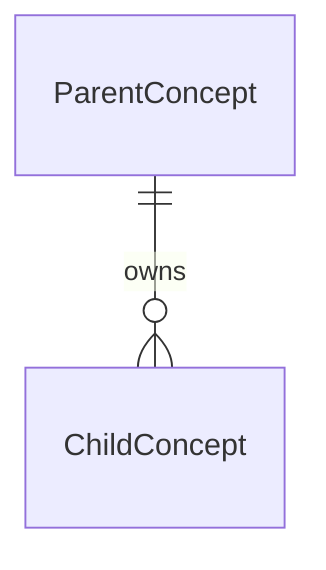

# Specify Domain

Create, reconstruct, or revise the specification foundation for one bounded product domain. Before this workflow is adopted, existing code, tests, plans, and documentation are evidence for human review. After `docs/spec/catalog.md` exists, semantic specification artifacts in `docs/spec/` are authoritative for intended behavior, while implementation records, code, and tests remain evidence of observed implementation.

Standalone use-case semantics are owned by `/spec-uc`. When a foundation change affects accepted use cases, `/spec-domain` owns discovery, combined review, approval, and atomic application of the complete coordinated set in one workflow.

## Input

Treat the user's complete invocation text as the request; it need not begin with or separately name a domain. Infer one domain title, lowercase kebab-case directory slug, and intended scope from that text, the current conversation or open file, and repository evidence. When one resolution is clear, proceed without asking the user to restate the request in a domain-first format. When no resolution is clear or multiple domains are plausible, call `AskUserQuestion` and let the user choose among concrete candidate domains before semantic discovery or writing; include creating a new domain only when the request supports it. If the invocation text is empty, use an unambiguous current context or ask the user to choose.

## User Decisions, Stage Gates, and Skill Continuation

Call `AskUserQuestion` whenever a user decision is needed before recording a semantic choice as settled. Give only needed context and concrete mutually exclusive options; recommend one only when repository or specification evidence supports it. Do not ask the user to decide repository facts or leave actionable choices in a summary. **For every semantic foundation change that needs a decision, call `AskUserQuestion` and wait for the answer before using Write/Edit on any specification file.** Resolve all semantic choices before final approval, continuing independent discovery when possible.

Use the host-provided **Other** response for free text; do not define a duplicate option. At an authorization gate, only selection of the named action authorizes it; otherwise treat entered text as feedback or an alternative proposal.

An actionable stage gate is a point where the user must authorize a persisted state transition, choose whether work advances, or transfer control to another specification skill. Use `AskUserQuestion` at every actionable stage gate; narrative text alone never authorizes advancement. In this workflow, answers to semantic questions refine only the in-conversation proposal; they never authorize Write/Edit. After final approval, deterministic writing, validation, recovery, and status calculation continue without another prompt. Once validation finishes, use a separate named handoff gate for any implementation follow-up.

For a cross-skill handoff, name the target, artifact, and reason, then use one explicit continue-or-stop gate. Invoke the target only after the continue action is selected. If invocation is unavailable, preserve state and provide the exact manual command. A returning caller must rediscover its scope.

## Invariants

- Store specifications only under `docs/spec/`.
- Each domain owns one `domain.md`, one `entity-model.md`, root-level numbered use cases, and optional matching observed-code records under `implementation/`.
- A use case and implementation record pair by sequence and slug. The record is observed-code evidence, not semantic authority, and may be absent when code does not yet exist. The record links back to the use case; the semantic use-case file does not require an implementation link.
- The root catalog contains a concise product definition, specification authority, the shared layout, and one linked heading with a one-sentence description per domain. Keep it navigational; detailed behavior belongs to domain, Entity Model, and use-case artifacts.
- Domain documents contain no use-case status, owner, date, or progress fields.
- Existing non-specification documents remain where they are unless the user separately requests a move.
- This skill changes specification documents only, never application code or tests.

## Specification Authority

When `docs/spec/catalog.md` exists, the root catalog, domain documents, and Entity Models are the reviewed foundation; `Approved` and `Implemented` use cases are accepted implementation contracts; and `Draft` and `Review` use cases are authoritative proposals, not implementation targets. Code and tests remain evidence of observed implementation, and differences from accepted specifications are implementation drift.

Stop on specification contradictions. Resolve product, domain, requirement, Entity Model, cross-use-case invariant, and terminology conflicts in this workflow. For a conflict limited to one interaction's behavior or status, use `AskUserQuestion` to offer direct continuation with `/spec-uc`; if selected, invoke it with the affected path and conflict.

## Stage 1 — Discover and Propose

1. Read the repository's `AGENTS.md`, `CLAUDE.md`, or equivalent instructions.
2. Read `docs/spec/catalog.md` when present and inspect neighboring domain documents, Entity Models, root-level use cases, and matching implementation records.
3. Use an existing `docs/spec/<domain>/implementation/<sequence>-<slug>.md` record as initial code navigation. Confirm its backlink, entry, linked locations, and verification summary, then inspect those locations as needed. Broaden discovery when the record is missing, stale, contradictory, or insufficient. A record is optional: offer paired `Capture` only when the user requests durable navigation evidence, and `Refresh` when an existing record is stale. Do not create or refresh a record for a `Draft` or `Review` from this workflow. Only code with no use case uses unpaired `/spec-impl <domain> <capture request>`.
4. Inspect relevant product documents, focused source, tests, and historical evidence, using Specification Authority to distinguish intended behavior from implementation evidence. Separate stated intent, observed behavior, implementation drift, contradictions, gaps, and assumptions. Surface conflicts inside the specification set instead of resolving them from code.
5. Bound the domain around one coherent product capability. Propose smaller domains when the vocabulary or responsibility is not comfortably reviewable as one unit.
6. Identify coherent requirement contracts, each with its capabilities and only the guarantees, constraints, and candidate use cases that it owns. Identify Entity Model external concepts, owned concepts and properties, relationships and cardinalities, shared value types, and concept-local invariants. Represent closed enumeration values in their owning property rows; do not create global policy, constraint, or enumeration sections.
7. Assign every normative statement to exactly one owning location before proposing artifacts: a property constraint, a concept-local invariant, a domain requirement, or one use case. Do not persist this ownership analysis.
8. Screen each candidate as one externally meaningful primary-actor goal spanning an observable trigger through a meaningful outcome. Keep variants and failures serving the same goal together; do not create separate candidates merely for endpoints, CRUD operations, internal components, validations, or individual steps. Split independently valuable goals, triggers, or outcomes.
9. Inspect existing use cases of every status for effects from a proposed domain-boundary or Entity Model change. Classify each as an accepted member of a Coordinated Domain Change, an unchanged nonconflicting proposal, or a conflicting `Draft` or `Review` blocker.

Before any semantic write, prepare only this concise review summary and ask all required questions before editing:

```markdown
# Domain Review: [Domain]

## Proposed Semantic Changes

- **Product or domain definition:** [Behaviorally material change, if any.]
- **Boundary and scope:** [Owns, excludes, and responsibility changes.]
- **Requirements:** [Requirement contracts and their capability, guarantee, constraint, or owning-use-case changes.]
- **Entity Model:** [External concepts, relationship diagram, owned concepts and properties, concept-local invariants, and shared value types that would change.]
- **Candidate use cases:** [Names and one observable outcome each.]

## Affected Use Cases and Proposed Deltas

| Path | Current Status | Proposed Behavioral Delta | Resulting Status | Write Set |
|---|---|---|---|---|
| [Path] | [Status] | [Concise delta or blocker] | [Status or blocked] | [Included, unchanged, or blocked] |

## Decisions Needed

## Contradictions and Assumptions

## Evidence Consulted

## Affected Specification Paths
```

The summary must expose every behaviorally material choice without reproducing complete generated artifacts. Do not print or persist generated specification artifacts before approval, choose business intent, or interpret silence as approval. Keep existing accepted files unchanged during review. For an ordinary foundation change, resolve every decision and call one final `AskUserQuestion` offering **Approve and apply foundation** or **Stop without applying**; free text revises the proposal.

## Coordinated Domain Changes

When a proposed domain or Entity Model change affects existing `Approved` or `Implemented` use cases, `/spec-domain` is the sole application coordinator and owns combined review and application in the current workflow:

1. Keep every persisted specification unchanged while discovering the complete foundation and use-case set. Read each affected accepted artifact and prepare its semantic delta with the foundation delta. The affected accepted path list must equal the eventual coordinated use-case write set.
2. Preserve each use-case path and sequence. Apply the self-contained Coordinated Use-Case Contract below, including its `Approved Removal` exception. A revised `Approved` member remains `Approved`; a revised `Implemented` member becomes `Approved` until `/spec-impl` re-establishes conformance. Every finalized member has no `## Open Questions`.
3. Discover affected `Draft` and `Review` artifacts but do not automatically include or promote them. Leave a nonconflicting proposal unchanged. A proposal that would conflict with the revised foundation blocks approval and application; it may not be included, waived, or left stale. Use `AskUserQuestion` to offer direct continuation with `/spec-uc` to resolve that artifact or to stop. After it is resolved and `/spec-uc` offers continuation back, rediscover the complete coordinated set before seeking approval.
4. Resolve every semantic choice with `AskUserQuestion`, batching independent choices when useful. Do not seek separate approval for individual members.
5. When the complete set is conflict-free and no decision remains, re-read every target and present one concise whole-set summary. Call one final `AskUserQuestion` offering **Approve and apply complete set** or **Stop without applying**; free text revises the proposal. Only the named approval action authorizes the foundation and every listed use-case delta as one unit.
6. After whole-set approval, immediately capture the exact pre-application content or nonexistence of every coordinator-owned target, including the root catalog, domain document, Entity Model, and each included use case. Verify that every target and the affected membership still match the reviewed baseline before the first write.
7. Behavior-neutral drift may be rebased only by updating the summary and recapturing pre-images. Semantic drift, changed membership, a newly discovered decision, or a newly discovered conflicting proposal invalidates the whole-set approval. Write nothing—or restore captured pre-images if application started—then resolve the issue through `AskUserQuestion`, rebuild the summary, and obtain whole-set approval again.
8. Otherwise use Write/Edit to apply the complete approved foundation and use-case set in one uninterrupted application phase. Cross-validate the complete set before reporting success.
9. If a write or validation fails, finish the exact approved set when doing so needs no new semantics; otherwise restore every coordinator-owned target to its captured content or nonexistence and validate the restoration. Never report partial application as success. If restoration fails, report the workflow as blocked and inconsistent.
10. After a coordinated application validates, identify every finalized accepted member whose behavior changed and every existing record that became stale. Offer the applicable `/spec-impl` continuation: `Removal` for an `Approved Removal`, `Execute` for missing or drifting behavior, and `Refresh` for a stale existing record. The absence of an optional record alone requires no handoff. Rediscover the domain after each return.

### Coordinated Use-Case Contract

For every normal finalized member:

- require exactly one visible Status line and exactly one Goal, Actors, Preconditions, Trigger, Behavior Diagrams, Flow, and Postconditions section;
- place Behavior Diagrams between Trigger and `## Flow`, with one `### Overview` subsection containing exactly one fenced `mermaid` block;
- allow no more than three additional named process subsections, each containing exactly one fenced `mermaid` block, and ensure every diagram projects behavior stated in the textual flow;
- preserve one externally meaningful primary-actor goal from an observable trigger through meaningful success and failure postconditions;
- keep the diagram focused on the goal, decisions, state transitions, and outcomes, using concise labels and no UI layout or styling;
- keep normal steps ordered and branches inline at their divergence points, with essential observable UI behavior only; use Entity Model terminology and introduce no architecture, implementation tasks, test cases, or duplicate acceptance-criteria section; and
- preserve the approved path and sequence, apply the resulting status rule above, and omit `## Open Questions`.

An `Approved Removal` member is the only structural exception. It contains exactly one H1, exactly one visible `**Status:** Approved` line, exactly one `## Approved Removal` section with exactly these fields: `Interaction to remove`, `Required observable absence`, and `Final verification`, no other sections, and no `## Open Questions` heading. Preserve its path and every `docs/spec` reference until `/spec-impl` verifies removal.

## Stage 2 — Write After Explicit Approval

After selection of the applicable named approval action:

1. Re-read every target and verify that the reviewed membership, semantic baseline, and write set still match. If a new semantic decision appears, invalidate approval, ask the user, refresh the review, and request approval again before writing.
2. Capture the exact pre-application content or nonexistence of every target before the first write.
3. Apply the complete set with Write/Edit in one uninterrupted specification-only phase. For a Coordinated Domain Change, use the combined membership and recovery contract above; never defer accepted members to separate review commands.
4. For a new or existing domain, preserve unrelated catalog entries, requirement contracts, use-case links, and detailed use cases; create or update only the approved focused deltas and avoid regenerating reviewed documents.
5. Cross-validate the complete write set. If writing or validation fails, finish the exact approved set only when no new semantics are needed; otherwise restore every captured pre-image or nonexistence and validate the restoration. Report failed restoration as blocked and inconsistent.
6. Do not persist evidence lists, traceability IDs, lifecycle history, generated metadata, or implementation details in semantic specification artifacts. `/spec-impl` owns optional implementation records; existing records remain outside this skill's write set.

For ordinary foundation changes, create or update the canonical root catalog, `domain.md`, and `entity-model.md` as required. When the root catalog exists, preserve its product definition, Specification Authority section, Structure section, and unrelated domain entries unless the approved change explicitly includes them. Omit a requirement's `Use cases` field until a linked use-case file exists, and route an affected standalone use-case change through the named `/spec-uc` continuation rather than writing it here.

## Canonical Postapproval File Structures

Use these structures to generate files with Write/Edit after approval. They are not response templates.

### `docs/spec/catalog.md`

````markdown
# Product Specifications

[One short product definition.]

## Specification Authority

This catalog marks `docs/spec/` as the source of intended product behavior:

- The catalog, domain documents, and Entity Models form the reviewed specification foundation.
- `Approved` and `Implemented` use cases are accepted implementation contracts.
- `Draft` and `Review` use cases record proposals and are not implementation targets.
- Code, tests, and implementation records describe observed implementation. Differences from accepted specifications are implementation drift.
- Specification contradictions require human resolution before affected behavior changes.

## Structure

Each domain uses the same layout:

```text
<domain>/
├── domain.md
├── entity-model.md
├── NNN-<use-case>.md
└── implementation/
    └── NNN-<use-case>.md
```

- `domain.md` defines the boundary and requirement contracts, with links to their use cases.
- `entity-model.md` defines external and owned concepts, their properties, relationships, invariants, and shared value types.
- `NNN-<use-case>.md` defines one observable system use case.
- `implementation/NNN-<use-case>.md` optionally records its current code path and proof, and links back to the use case.
- Use-case sequence numbers are append-only and local to the domain root.

## Domains

### [[Domain]]([domain]/domain.md)

[One-sentence domain description.]
````

Keep the catalog concise and navigational. State the product definition, authority policy, and shared layout once; do not copy domain requirements, entity details, use-case behavior, implementation evidence, or workflow instructions into it. Sort domain entries alphabetically. Each entry contains one linked H3 domain name followed by one sentence describing the domain. Do not add a standalone code-formatted directory-name line; the link already identifies the path.

### `docs/spec/<domain>/domain.md`

```markdown
# [Domain]

[One-sentence definition.]

**Entity Model:** [[Domain] Entity Model](entity-model.md)

## Contents

- [Boundary](#boundary)
- [Requirements](#requirements)
  - [[Requirement]](#requirement)

## Boundary

- **Owns:** [Broad responsibility owned by this domain.]
- **Excludes:** [Closely related responsibilities owned elsewhere.]

## Requirements

### [Requirement]

**Capabilities**

- [Actor-recognizable outcome owned by this requirement.]

**Guarantees**

- [Consistency, preservation, continuity, or bounded-work promise.]

**Constraints**

- [Access, security, compatibility, platform, or integration obligation.]

**Use cases**

- [NNN — Use Case](NNN-use-case.md)
```

The domain document uses the order shown above: definition, Entity Model link, Contents, Boundary, then Requirements. `Contents` links to Boundary, Requirements, and every requirement H3 in document order. Keep it as a compact navigation list; do not link requirement fields or use cases there. Boundary contains one broad `Owns` statement and one broad `Excludes` statement; it establishes responsibility without repeating requirement details.

Each requirement is one coherent domain responsibility. `Capabilities` is required. Add `Guarantees`, `Constraints`, and `Use cases` only when applicable, using short bullets rather than compound paragraphs. Omit empty sections and placeholders. Keep only domain-wide contracts: interaction steps and essential UI behavior belong to use cases, property rules belong to the Entity Model, and code mechanics belong to code or an optional implementation record. State each guarantee and constraint once under its narrowest owning requirement. A use case may be linked by multiple requirements when it materially implements each one.

### `docs/spec/<domain>/entity-model.md`

````markdown
# [Domain] Entity Model

## External Concepts

### [External Concept]

[Definition and the facts this domain relies on.]

## Entity Relationship Diagram


```mermaid
erDiagram
    ParentConcept ||--o{ ChildConcept : owns
```

## Concepts

### [Concept]

[Definition in domain language.]

#### Properties

| Property | Type | Cardinality | Meaning | Constraints |
|---|---|---:|---|---|
| [Property] | [Primitive, Shared Value Type, or Enumeration] | [1, 0..1, 0..*, or 1..*] | [Domain meaning] | [Property constraint or allowed enumeration values] |

## Shared Value Types

| Type | Meaning | Constraints |
|---|---|---|
| [Shared Value Type] | [Reused domain meaning] | [Reusable validation, representation, or security constraint] |
````

Use the section order shown above: external concepts first, then the Entity Relationship Diagram, owned concepts, and optional shared value types. Omit `External Concepts` or `Shared Value Types` only when the domain has none; do not add empty sections.

The Entity Relationship Diagram is the sole representation of relationships and relationship cardinalities. Keep every ER diagram, include every owned concept and connected external concept, and use short active relationship labels. Do not repeat the same relationships in prose or per-concept tables. Explain conditional relationship rules only as an invariant under the concept that owns them.

Write every relationship label as an active, present-tense source-to-target verb. Prefer the standard names `owns`, `contains`, `uses`, `references`, `maps_to`, `compares_to`, `results_in`, and `affects`. Use a precise domain verb such as `describes`, `tests`, or `protects` only when none of the standard names preserves the meaning. Avoid vague `has`, lifecycle-ambiguous synonyms such as `retains`, and passive or inverse labels such as `owned_by`, `recorded_by`, or `used_by`.

Treat `String`, `Boolean`, `Integer`, `Decimal`, `Duration`, `Timestamp`, and `Enumeration` as built-in property types. For `Enumeration`, list the complete allowed values in that property's `Constraints` cell and explain only value semantics that are not evident from the property meaning and value name; do not create a global enumeration section.

Use `## Shared Value Types` only for a value reused by multiple properties or use cases, or for a value with important reusable representation or security semantics. Put one-off scalar meaning and validation directly in the owning property row rather than creating a named type. Every other non-primitive property type must resolve to a Shared Value Type.

Keep complete property tables. Use cardinality for property multiplicity: `1`, `0..1`, `0..*`, or `1..*`. Put a rule about one property in its `Constraints` cell and split compound constraints into separate sentences. Add `#### Invariants` only for always-valid rules involving multiple properties, states, or connected concepts. Do not repeat one rule in both a property constraint and an invariant.

Do not create global `Policies`, `Concept Constraints`, or `Enumerations` sections. Domain requirements own shared obligations; Entity Models own structure and always-valid rules; use cases own ordered behavior, essential UI intent, decisions, failures, retries, and outcomes. Exclude UI presentation, code mechanics, and procedural interaction flows from the Entity Model. Keep each normative statement in exactly one location.

`/spec-domain` owns every domain requirement and Entity Model change, including a delta discovered while reviewing one use case. `/spec-uc` owns only interaction artifacts and must hand foundation work to this workflow for coordinated review.

Exclude SQL types, indexes, ORM tags, migrations, controllers, services, caches, and implementation-only fields.

## Validation

After coordinated path or link changes, run the shared mechanical checker for the affected domain when available:

```bash
python3 "$HOME/.claude/skills/spec-validator/validate_spec.py" docs/spec/<domain>
```

Within the selected domain, it checks the required catalog and foundation files, domain navigation and ownership links, use-case structure and diagrams, sequence uniqueness, local links, and optional implementation records. Continue to perform the domain-specific semantic, diagram, and requirement checks below.

Before reporting completion:

- Confirm the root Domains entries link to domain documents, all links resolve, entries are alphabetical, and each linked H3 is followed by one description without a standalone directory-name line.
- Confirm the root catalog contains the canonical Specification Authority semantics.
- Confirm domain-document links resolve, every use-case file is linked by at least one owning requirement, and no nonexistent use case is linked.
- Confirm each domain document orders its definition, Entity Model link, Contents, Boundary, and Requirements as specified and contains no separate Domain metadata table, Scope section, requirement-type table, or global Use Cases index.
- Confirm Contents links once to Boundary and Requirements, then to every requirement heading in document order, with no deeper field or use-case links.
- Confirm Boundary contains exactly one broad `Owns` statement and one broad `Excludes` statement without repeating requirement details.
- Confirm every requirement has a concise `Capabilities` list, omits empty optional sections, owns each listed guarantee and constraint without duplication, and links only materially implementing use cases.
- Confirm the Entity Model orders External Concepts, the Entity Relationship Diagram, Concepts, and optional Shared Value Types as specified, omitting only empty optional sections.
- Confirm the Entity Relationship Diagram is one valid Mermaid `erDiagram`, contains every relationship and relationship cardinality, and every node resolves to an owned or external concept.
- Confirm relationship labels are active source-to-target verbs, use the standard vocabulary when it preserves meaning, and contain no vague or passive aliases.
- Confirm concepts contain no relationship tables and the diagram's relationships are not restated elsewhere.
- Confirm concept definitions are concise, property tables remain complete, and the Entity Model contains no UI presentation, code mechanics, or procedural use-case flow.
- Confirm every property uses explicit cardinality, every `Enumeration` lists its allowed values in the property row, and no global `Enumerations` section exists.
- Confirm every non-primitive property type resolves to a Shared Value Type and each shared type is reused or carries important reusable representation or security semantics.
- Confirm each `#### Invariants` subsection is necessary, concept-local, declarative, and free of duplicated property rules or interaction procedure.
- Confirm no global `Policies` or `Concept Constraints` section exists.
- Confirm normative statements are owned by exactly one location: domain requirement, property constraint, concept-local invariant, or use-case flow/postcondition. Downstream artifacts may rely on an owned rule but must not duplicate it.
- Confirm candidate use cases each span one externally meaningful primary-actor goal from an observable trigger through one meaningful outcome.
- Confirm variants and failures serving the same goal were not split into separate candidates, and independently valuable goals, triggers, or outcomes were not bundled.
- Confirm no candidate exists merely for an endpoint, button, CRUD operation, internal component, validation, or individual step.
- For ordinary domain work, confirm existing use-case files and statuses were not modified.
- Confirm the selected named approval action—not narrative or free text—authorized the current reviewed set.
- Confirm every target matched the reviewed baseline before writing and the complete write set was applied and cross-validated or every captured pre-image was restored and validated.
- For a coordinated application, confirm the discovered accepted-member list equals the applied use-case set, no conflicting `Draft` or `Review` remains, every member has the approved path, sequence, structure, diagram projection, and resulting status, and no finalized member contains `## Open Questions`.
- Confirm no partial application is reported as success and any failed restoration is reported as blocked and inconsistent.
- Confirm no status dashboard, owner/date field, identifier registry, persisted implementation plan, implementation detail, or code traceability instruction was introduced into semantic specification artifacts, and existing implementation records remain unchanged.
- For a coordinated application, confirm the post-validation `/spec-impl` handoff was offered for every affected accepted member with its resolved domain, sequence, and mode, or that the user selected **Stop after specification**.

## Handoff

Report only a concise outcome with changed paths, resulting state, approved decisions, unresolved blockers, affected use cases, validation, and recovery. Do not echo complete files or require another command to apply an already approved coordinated set. After validation, offer the named `/spec-impl <domain> <sequence>` continuation for each affected accepted member, with its mode and a **Stop after specification** action. Invoke that skill only when the user selects it, and provide an exact command only when invocation is unavailable or denied.

When `/spec-domain` is continued from `/spec-reconcile <domain>` for a selected-domain conflict, preserve the supplied base/ours/theirs/current-worktree evidence, change only that foundation or multi-use-case conflict, and never stage or complete the Git merge. After resolution, offer a named continuation back to `/spec-reconcile <domain>`; if selected, invoke it with the original domain so it rediscovers the scoped set before any deterministic repair.
